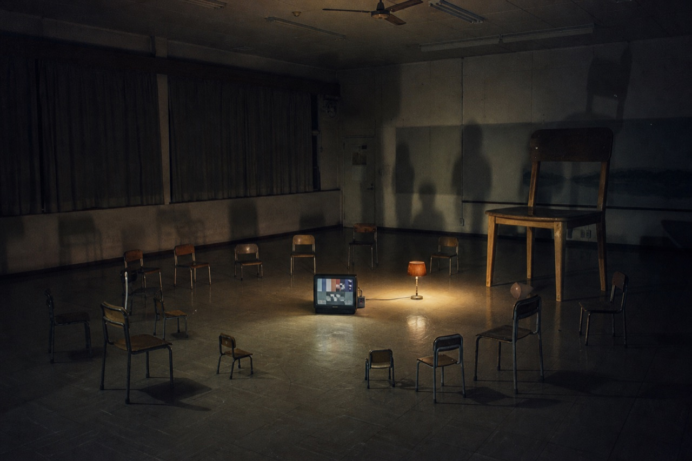

[English](README.md) · **Français**

# Un banc d'essai depuis l'atelier

Proposition de protocole d'évaluation des modèles, écrite depuis une pratique de création plutôt que depuis un laboratoire.

**[Lire la proposition](banc-d-essai-atelier.md)**

Trois faits ferment le débat sur les classements publics. Seize pour cent des bancs d'essai publiés utilisent des estimations d'incertitude ou des tests statistiques. Soixante-trois pour cent de ceux qui sont mis en avant ne servent qu'à un seul constructeur de modèles. Et aucun système automatique d'évaluation esthétique ne dépasse 0,55 d'accord avec un jury de professionnels, soit à peine mieux que le hasard.

Le protocole proposé évalue par phase de travail plutôt que par domaine, parce qu'on attend des choses opposées d'une phase à l'autre : de la divergence en exploration, de la contradiction en décision, de la fidélité exacte en exécution. Il couvre cinq catégories d'usage réel, et mesure trois choses qu'aucun instrument existant ne regarde : le refus argumenté, l'écart entre propositions comme antidote à l'homogénéisation, et la fidélité au capté.

Il documente aussi la pile d'outils libres pour le construire, et l'ordre dans lequel s'y prendre.

---

Ismaël Joffroy Chandoutis est artiste et cinéaste. Son travail traverse les arts numériques, l'art contemporain et le cinéma.
[ismaeljoffroychandoutis.com](https://ismaeljoffroychandoutis.com)

Texte sous licence [CC BY-SA 4.0](LICENSE).
